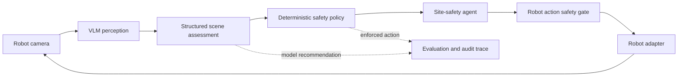

# Inspectron

**Embodied VLM agent for autonomous site-safety assessment.**

Inspectron is a robotics AI prototype that enables a mobile robot to inspect warehouse or construction scenes, identify navigation hazards, and choose safe actions through a closed-loop perception and control workflow.

A Vision-Language Model proposes a structured scene assessment, but it never controls the robot directly. A deterministic safety policy validates the assessment, overrides unsafe recommendations, and passes the resulting action through a final execution gate.

## Capabilities

- Structured visual assessment using a local or API-hosted VLM
- Multi-label hazard detection
- Traversability classification
- Deterministic safety-policy enforcement
- Model-versus-policy disagreement tracking
- Active reinspection when visual evidence is weak
- Reduced-speed movement through restricted areas
- Adaptive multi-waypoint mission execution
- Batch evaluation with safety and latency metrics
- Local multimodal inference through Ollama and Qwen3-VL
- Fail-safe mission termination on perception or robot errors

Supported hazards:

- `human_in_path`
- `debris`
- `liquid_spill`
- `open_edge`
- `fire_or_smoke`
- `unstable_load`

Supported actions:

- `proceed`
- `slow_down`
- `stop`
- `reroute`
- `inspect_closer`

## Architecture



The system deliberately separates learned perception from deterministic control:

1. The VLM analyzes an image.
2. The response is validated against a strict site-safety schema.
3. A symbolic safety policy resolves the safe action.
4. The agent chooses the next mission step.
5. The execution gate validates the robot action.
6. The robot moves, reinspects, stops, or reports completion.

See [docs/architecture.md](docs/architecture.md) for the detailed design.

## Quick Start

Requirements:

- Python 3.11 or newer
- Ruff for development checks
- Ollama only when running local VLM inference

Create an environment and install the package:

```bash
python3.11 -m venv .venv
source .venv/bin/activate
python -m pip install -e ".[dev]"
```

Run the deterministic simulated mission:

```bash
inspectron-demo
```

You can also run it without installing the package:

```bash
PYTHONPATH=src python3 -m inspectron.cli
```

The baseline mission demonstrates:

- normal movement through a clear aisle;
- reduced-speed movement after detecting debris;
- active reinspection when evidence is insufficient;
- mission completion only after required coverage.

## Local VLM Inference

Inspectron supports local structured multimodal inference with Ollama.

Pull the model:

```bash
ollama pull qwen3-vl:8b
```

Run an assessment on a real site-safety image:

```bash
PYTHONPATH=src python3 -m inspectron.vlm_cli \
  --provider ollama \
  --base-url http://localhost:11434 \
  --model qwen3-vl:8b \
  --image "/absolute/path/to/site_safety_image.jpg" \
  --waypoint aisle_real_01 \
  --scene-id warehouse_scene_01 \
  --evidence-id warehouse_frame_001
```

The result contains both the model recommendation and the action enforced by the safety policy:

```json
{
  "traversability": "restricted",
  "hazards": ["debris"],
  "model_recommended_action": "slow_down",
  "enforced_action": "slow_down",
  "policy_overrode_model": false,
  "confidence": 0.91,
  "view_quality": 0.86
}
```

An OpenAI-compatible multimodal endpoint can also be selected with `--provider openai`.

## Batch Evaluation

An example evaluation manifest is provided at:

```text
benchmarks/manifests/site_safety_smoke.example.json
```

Add matching images beneath a local data directory and run:

```bash
PYTHONPATH=src python3 -m inspectron.vlm_eval_cli \
  --manifest benchmarks/manifests/site_safety_smoke.example.json \
  --data-root benchmarks/images \
  --base-url http://localhost:11434 \
  --model qwen3-vl:8b \
  --output artifacts/metrics/site_safety_smoke.json
```

Use `--runs 3` to evaluate the same ordered samples sequentially. A single
run preserves the original report schema. Repeated reports retain every run,
summarize each aggregate metric with its mean, population standard deviation,
minimum, and maximum, and measure scene-level prediction agreement.

The evaluation report measures:

- traversability accuracy;
- exact multi-label hazard match;
- hazard micro precision, recall, and F1;
- per-hazard support, counts, precision, recall, and F1 for every hazard class;
- a traversability confusion matrix with an explicit error column for failed inference;
- model action accuracy;
- safety-enforced action accuracy;
- policy override rate;
- unsafe-motion counts before and after policy enforcement;
- mean inference latency;
- parsing and inference failures.

The example manifest defines the expected format but does not include benchmark images. Failed samples never receive exact-match credit, and their expected hazards count as false negatives in the micro-averaged hazard metrics. Every report records reproducibility metadata: run timestamp, package version, manifest path, and manifest SHA-256. If every sample fails, the evaluator still writes a diagnostic report and exits with a nonzero status.

The real-image benchmark — label taxonomy, licensing rules, provenance requirements, and the candidate review log — is documented in [benchmarks/DATASET.md](benchmarks/DATASET.md).

### 42-scene real-image benchmark results

The complete benchmark — 42 provenance-verified images, six per scene group,
labels frozen before inference — was evaluated with one single pass and a
three-run repeated evaluation (126 inference calls in total).

| Metric | Result |
|---|---:|
| Successful inference | 126/126 across 3 runs |
| Safety-enforced action accuracy | 90.5% (38/42) |
| Hazard micro precision / recall / F1 | 90.5% / 80.9% / 85.4% |
| Hazard exact-set match | 73.8% |
| Traversability accuracy | 64.3% |
| Policy override rate | 0.0% |
| Unsafe-motion decisions | 2 of 42 |
| Mean prediction agreement | 100.0% |
| Fully stable scenes | 42/42 |
| Mean on-device latency | 54.5 seconds/image (±0.18 across runs) |

Three runs at temperature 0 produced identical joint predictions for every
scene, so every failure below is reliably reproducible rather than sampling
noise.


The headline findings are about the *boundary* of the architecture:

- **Enforcement bounds inconsistency, not ignorance.** The policy override
  rate was 0.0%: the model was internally self-consistent on all 42 scenes,
  so both unsafe motions came from hazards the model never perceived — a
  railway platform edge read as a completely clear corridor at confidence
  1.0, and a second platform edge read as minor debris. When perception
  omits a hazard outright, output-side enforcement is structurally blind;
  the residual risk is a perception-recall problem, not a control problem.
- **Model confidence is inverted as a safety signal.** Scenes reported at
  confidence 1.0 were the least accurate bin (66.7%), while 0.95 scenes
  were flawless (26/26); wrong answers averaged higher confidence than
  correct ones.


- **Failures are class-specific, not diffuse.** Liquid spills and fire
  scored perfect precision and recall; the misses concentrate in platform
  edges and unstable loads (recall 0.67 each) and in people standing near
  vehicles or equipment (`human_in_path` recall 0.71 — the model omitted
  firefighters in three fire scenes while catching every human who was the
  primary subject).
- The pilot's stable failure (`unstable_load_001`, reroute instead of stop
  at confidence 1.0) reproduced identically for the third consecutive run
  set.

Full analysis including the traversability confusion matrix, per-scene
table, calibration bins, and a disclosed generation-budget fix:
[docs/results/site_safety_42.md](docs/results/site_safety_42.md), with the
machine-readable three-run report in
[docs/results/site_safety_42_repeated_3.json](docs/results/site_safety_42_repeated_3.json).
The earlier seven-scene pilot is preserved in
[docs/results/site_safety_pilot_7.md](docs/results/site_safety_pilot_7.md).

## Testing

```bash
ruff check .
PYTHONPATH=src python3 -m unittest discover -s tests -v
```

The tests cover structured VLM parsing, safety-policy precedence, unsafe model overrides, mission termination, active reinspection, speed reduction, rerouting, client behavior, and evaluation metrics.

## Project Structure

```text
src/inspectron/
├── agent.py                 # Closed-loop site-safety agent
├── mission.py               # Adaptive mission orchestrator and ports
├── safety.py                # Final robot-action validation
├── site_safety.py           # Scene schema and deterministic policy
├── simulation.py            # Deterministic robot and perception adapters
├── repeated_evaluation.py   # Repeated-run statistics and agreement
├── vlm.py                   # VLM prompt, schema, and output parser
├── vlm_cli.py               # Single-image inference CLI
├── vlm_eval_cli.py          # Batch safety evaluation
└── clients/
    ├── ollama.py            # Native Ollama multimodal client
    └── openai_compatible.py # OpenAI-compatible client
```

## Current Limitations

- Robot execution is currently simulated.
- Third-party benchmark images are not committed; they are reconstructed from provenance-pinned download URLs and SHA-256 hashes.
- The real-image benchmark contains 42 scenes with one image per scene, so per-class rates carry wide confidence intervals and no statistical representativeness is claimed.
- VLM confidence values are measurably miscalibrated (the highest-confidence bin is the least accurate); they are treated only as a weak-evidence trigger, never as permission.
- The rerouting policy selects another required waypoint but does not yet use a geometric path planner.
- The system is a research prototype and is not safety-certified.

## Roadmap

- Scale the licensed real-image benchmark from 7 to 42 images
- Add confidence calibration and run repeated evaluation on the 42-image benchmark
- Integrate ROS 2 robot and camera adapters
- Add Gazebo or Isaac Sim scenarios
- Move the final safety supervisor into a C++ ROS 2 node
- Benchmark quantized inference and edge deployment
- Add trajectory logging and operational observability

## Safety Principle

The VLM is advisory. It cannot directly issue actuator commands. Every recommendation is resolved by a deterministic policy and validated again at the robot-control boundary.
