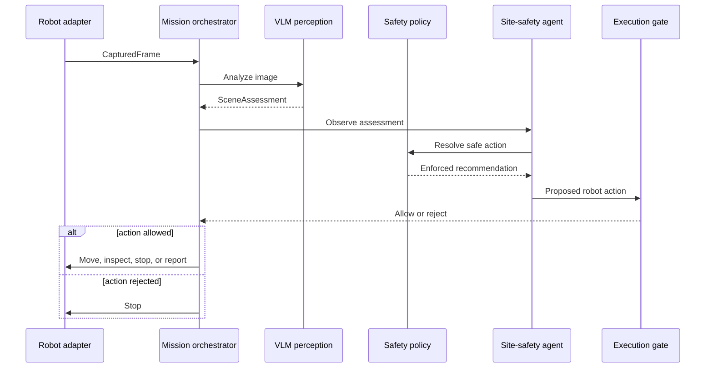

# Inspectron Architecture

## 1. Objective

Inspectron is an embodied Vision-Language Model system for autonomous site-safety assessment.

The system combines:

- multimodal scene understanding;
- a structured perception contract;
- deterministic safety reasoning;
- closed-loop agent behavior;
- robot-action validation;
- measurable safety evaluation.

The central design rule is that learned model output is advisory. Deterministic components retain authority over robot movement.

## 2. System Boundary

Inspectron currently accepts camera images and simulated robot state. It produces validated mission actions and an auditable assessment trace.

Current inputs:

- camera-frame path;
- waypoint and scene identifiers;
- required mission waypoints;
- robot position and blocked-waypoint state.

Current outputs:

- structured scene assessments;
- model-recommended actions;
- policy-enforced actions;
- robot action trace;
- safety-policy overrides;
- mission coverage and termination status;
- evaluation and latency metrics.

Physical robot drivers, mapping, localization, and geometric path planning are outside the current implementation.

## 3. Data Flow



## 4. Core Components

### Scene-safety domain

`site_safety.py` defines:

- `Traversability`
- `HazardType`
- `RecommendedAction`
- `SceneAssessment`
- `resolve_safe_action`
- `find_consistency_violations`

This module contains no model or robot dependencies. It is the deterministic safety-policy core.

### VLM perception

`vlm.py` converts a `CapturedFrame` into a `SceneAssessment`.

Responsibilities:

- construct the multimodal site-safety prompt;
- require structured JSON output;
- validate supported traversability values;
- validate multi-label hazards;
- validate the recommended action;
- reject missing, malformed, or out-of-range fields.

The Ollama adapter additionally sends a JSON Schema as the structured output format.

### Site-safety agent

`agent.py` maintains mission state and converts assessments into robot actions.

It tracks:

- visited waypoints;
- views captured per waypoint;
- assessment history;
- policy override count.

Agent behaviors include:

- immediate stop for critical hazards;
- another inspection for weak evidence;
- stop after the maximum number of uncertain views;
- reduced-speed movement through restricted scenes;
- selection of another required waypoint after a blocked route;
- reporting only after required coverage.

### Mission orchestrator

`mission.py` implements the closed-loop mission:

```text
capture → perceive → observe → decide → validate → execute → repeat
```

The mission terminates with one of:

- `completed`
- `safety_stop`
- `validation_failure`
- `step_limit`

Robot and perception implementations are injected through protocols, keeping the mission logic independent of Ollama, ROS 2, or the simulator.

### Execution safety gate

`safety.py` validates proposed robot actions immediately before execution.

It enforces these invariants:

- movement requires a target;
- movement targets must belong to the mission;
- blocked waypoints cannot be entered;
- inspection can occur only at the current waypoint;
- reporting requires complete waypoint coverage;
- stopping is always permitted.

This gate protects the robot boundary even if an earlier component proposes an invalid action.

### Simulation adapters

`simulation.py` supplies deterministic robot and perception adapters.

The baseline warehouse scenario exercises:

- clear-path travel;
- reduced-speed travel around debris;
- uncertainty-driven reinspection;
- successful mission completion.

Simulation provides repeatable integration tests without requiring robot hardware.

## 5. Structured Perception Contract

A scene assessment contains:

```json
{
  "traversability": "clear | restricted | blocked | unknown",
  "hazards": [
    "human_in_path | debris | liquid_spill | open_edge | fire_or_smoke | unstable_load"
  ],
  "recommended_action": "proceed | slow_down | stop | reroute | inspect_closer",
  "confidence": 0.0,
  "view_quality": 0.0
}
```

`confidence` and `view_quality` must be numeric values between `0` and `1`.

The parser rejects unsupported labels instead of silently converting them.

## 6. Deterministic Safety Policy

Safety rules are applied in priority order:

| Priority | Condition | Enforced action |
|---|---|---|
| 1 | Human in path, open edge, fire or smoke, or unstable load | `stop` |
| 2 | Traversability is blocked | `reroute` |
| 3 | Confidence below 0.70, view quality below 0.60, or unknown traversability | `inspect_closer` |
| 4 | Restricted traversability or another reported hazard | `slow_down` |
| 5 | Clear scene with no hazards | `proceed` |

The policy result takes precedence over the model recommendation.

Both values are preserved so evaluations can measure:

- model-policy disagreement;
- override frequency;
- unsafe motion before enforcement;
- unsafe motion after enforcement.

This creates a hybrid learned-and-symbolic architecture: the VLM interprets the scene while explicit rules own safety decisions.

## 7. Active Perception

A single image may be blurred, occluded, dark, or ambiguous.

When evidence is weak, the agent requests another observation instead of proceeding. The current default permits two views per waypoint. If uncertainty remains after the view limit, the mission stops.

This behavior turns perception into a closed-loop process rather than a one-shot classifier.

## 8. Motion Behavior

Policy recommendations are converted into robot actions:

| Enforced recommendation | Robot behavior |
|---|---|
| `proceed` | Move at full speed scale |
| `slow_down` | Move at speed scale `0.35` |
| `inspect_closer` | Capture another view |
| `reroute` | Select another required waypoint at speed scale `0.50` |
| `stop` | Stop the mission |

The present rerouting behavior is waypoint-based. A future navigation adapter will delegate geometric route selection to a robot navigation stack.

## 9. Evaluation

The batch evaluator compares predictions with a labeled JSON manifest.

Reported metrics include:

- traversability accuracy;
- exact hazard-set match;
- hazard micro precision, recall, and F1;
- model action accuracy;
- enforced action accuracy;
- policy override count and rate;
- unsafe-motion counts;
- mean inference latency;
- per-sample errors.

Unsafe motion is counted when the expected action is `stop` or `reroute`, but the evaluated action would permit forward motion.

The most important comparison is:

```text
model unsafe motion count → enforced unsafe motion count
```

This directly measures whether the deterministic layer reduces unsafe decisions.

## 10. Failure Handling

Implemented validation includes:

- invalid image paths;
- unsupported image types;
- oversized images;
- unreachable inference services;
- malformed service responses;
- invalid VLM JSON;
- missing schema fields;
- unsupported labels;
- invalid confidence ranges;
- illegal robot actions;
- incomplete mission coverage.

A remaining improvement is mission-level fail-safe handling for perception-service exceptions. The intended behavior is to stop the robot, record the error, and return a controlled failure status.

## 11. Proposed ROS 2 Boundary

The Python system should retain:

- VLM inference;
- prompt and schema management;
- scene-assessment parsing;
- experiment configuration;
- evaluation and observability.

A future ROS 2 integration should provide adapters for:

- camera frames;
- localization and waypoint state;
- navigation goals;
- velocity limits;
- emergency stop;
- assessment and action telemetry.

The mission orchestrator can continue using the existing protocols while concrete ROS 2 adapters replace the simulated components.

## 12. Planned C++ Component

C++ is not required for the current VLM prototype.

The best future C++ component is the final ROS 2 safety supervisor because it sits at the performance-sensitive robot-control boundary. It should:

- consume proposed actions;
- enforce waypoint and velocity constraints;
- reject stale perception results;
- apply timeouts;
- issue emergency stops;
- publish auditable safety decisions.

The VLM and experimental agent logic should remain in Python unless profiling demonstrates a concrete performance requirement.

## 13. Trust Boundaries

The components have different authority levels:

```text
VLM perception        → may describe and recommend
Safety policy         → may override recommendations
Agent                 → may propose mission actions
Execution safety gate → may approve or reject actions
Robot controller      → executes only approved actions
```

No unvalidated VLM output crosses directly into the robot-control interface.

## 14. Current Non-Goals

The current version does not claim:

- physical robot deployment;
- safety certification;
- a production-scale benchmark;
- confidence calibration;
- online mapping or localization;
- geometric path optimization;
- distributed model training;
- real-time edge performance.

These are explicit future milestones rather than hidden assumptions.
